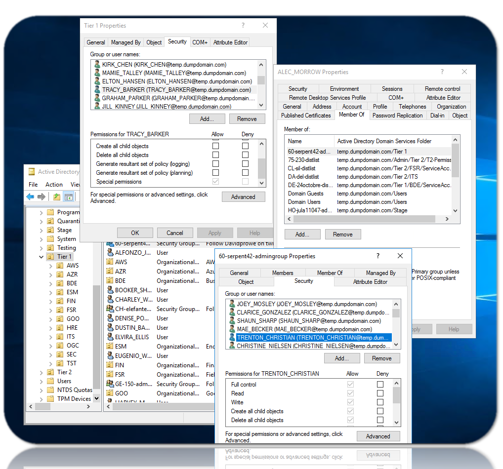

# ActiveDirectory
A curated list of awesome ActiveDirectory Pentesting resources


## [Bloodhound](https://github.com/BloodHoundAD/BloodHound)
is an amazing tool which can enumerate a domain automatically, save all the information, find possible privilege escalation paths and show all the information using graphs.

### install 
* linux 
```
apt-get install bloodhound
```

* windows
  * [Install Java](https://www.oracle.com/java/technologies/javase-jdk11-downloads.html)
  * [Install neo4j](https://neo4j.com/download-center/#community)
  * [Download the BloodHound GUI](https://github.com/BloodHoundAD/BloodHound/releases)

Tips:
```
you should download BloodHound-win32-x64.zip
after execute neo4j you should reset password and after click on BloodHound.exe you should use this credential
by default BloodHound does not any data and you should use SHarpHound for gather information
```

### DATA COLLECTION (ingestor)
* [SharpHound](https://github.com/BloodHoundAD/BloodHound/tree/master/Collectors) SharpHound is the official data collector for BloodHound. It is written in C# and uses native Windows API functions and LDAP namespace functions to collect data from domain controllers and domain-joined Windows systems. 
```
C:\> SharpHound.exe
```

* [BloodHound.py](https://github.com/fox-it/BloodHound.py) If you have domain credentials you can run a python bloodhound ingestor from any platform so you don't need to depend on Windows.

```
pip3 install bloodhound
bloodhound-python -u support -p 'yourpassword' -ns 10.10.10.192 -d blackfield.local -c all
```

Tips:
```
after run above program they generate some json file of users,computers,domains,groups.
we should import (drag& drop) all generated file into BloodHound GUI.
with Analysis section in GUI we can find Bug in ActiveDirectory
for exm: Find Shortest paths to Domain Admin, we can see user that can do Privileg esclation to dimain admin
right click on every yal->Help->ABUSE : we can see how to use vuln in AD !
```


## [BadBlood](https://github.com/davidprowe/BadBlood)
this is make a Vuln ActiveDirectory, it usefull for pentester for hunting vuln. 

Requirements:
* Active Directory Powershell Installed
 ```
 Install-WindowsFeature RSAT-AD-PowerShell
 ```
* BadBlood is designed to be run with a user who is a Domain Admin and Schema Admin.
```
whoami /groups
by default administrator user is not in Schema Admin and we should go to member of section and add current user to Schema admin group.
``` 


* final call 
```
git clone https://github.com/davidprowe/badblood.git
./badblood/invoke-badblood.ps1
```

### Tools
[GoFetchAD/GoFetch](https://github.com/GoFetchAD/GoFetch) - GoFetch is a tool to automatically exercise an attack plan generated by the BloodHound application.


### Refrences
* https://github.com/chryzsh/awesome-bloodhound
* https://book.hacktricks.xyz/windows-hardening/active-directory-methodology/bloodhound
* https://www.secframe.com/badblood/
* [install AD](https://computingforgeeks.com/how-to-install-active-directory-domain-services-in-windows-server/)

